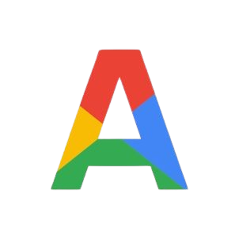

# Appsus - Your All-in-One Productivity Suite

A modern web application that combines essential productivity tools into one seamless experience. Built with vanilla JavaScript and React-like architecture.



## 🚀 Live Demo

Visit the live application: [https://liorlazar.github.io/Appsus/](https://liorlazar.github.io/Appsus/)

## 📋 Features

### 📧 Mail App (Gmail Clone)
- **Email Management**: Send, receive, and organize emails
- **Smart Folders**: Inbox, Sent, Starred, and Trash
- **Advanced Search**: Filter by sender, subject, date, and content
- **Categories**: Primary, Social, Promotions, and Spam filtering
- **Real-time Updates**: Dynamic email status and timestamps
- **Responsive Design**: Works seamlessly on desktop and mobile

### 📝 Note App (Google Keep Clone)
- **Rich Text Notes**: Create and edit text notes with formatting
- **Todo Lists**: Manage tasks with checkable items
- **Color Coding**: Organize notes with custom colors
- **Pin Important Notes**: Keep important notes at the top
- **Search & Filter**: Find notes quickly by content or title
- **Responsive Grid**: Masonry-style layout that adapts to screen size

### 🏠 Home Dashboard
- **Unified Access**: Central hub for all applications
- **Google-style Design**: Clean, modern interface inspired by Google Workspace
- **Quick Navigation**: One-click access to Mail and Notes
- **About Page**: Team information and project details

## 🛠️ Technologies Used

- **Frontend**: Vanilla JavaScript (ES6+)
- **Architecture**: React-like component system with custom hooks
- **Routing**: React Router DOM
- **Storage**: LocalStorage for data persistence
- **Styling**: CSS3 with Grid and Flexbox
- **Icons**: Google Material Symbols
- **Build**: No build process - pure web standards

## 📁 Project Structure

```
Appsus/
├── index.html                    # Main entry point
├── README.md                     # Project documentation
├── assets/
│   ├── css/
│   │   ├── main.css             # Main stylesheet
│   │   ├── basics/              # Base styles (vars, base, helpers, layout)
│   │   ├── cmps/                # Component styles
│   │   └── apps/                # App-specific styles
│   └── img/                     # Images and logos
├── apps/
│   ├── mail/
│   │   ├── cmps/                # Mail components
│   │   ├── pages/               # Mail pages
│   │   └── services/            # Mail services
│   └── note/
│       ├── cmps/                # Note components
│       ├── pages/               # Note pages
│       └── services/            # Note services
├── cmps/                        # Shared components
├── pages/                       # Main pages (Home, About)
├── services/                    # Shared services
└── lib/                         # External libraries
```

## 🚀 Getting Started

### Prerequisites
- Modern web browser (Chrome, Firefox, Safari, Edge)
- Local web server (optional but recommended)

### Installation

1. **Clone the repository**
   ```bash
   git clone https://github.com/liorlazar/Appsus.git
   cd Appsus
   ```

2. **Serve the files**
   
   **Option A: Using Live Server (VS Code)**
   - Install the Live Server extension
   - Right-click on `index.html` and select "Open with Live Server"
   
   **Option B: Using Python**
   ```bash
   python -m http.server 8000
   ```
   
   **Option C: Using Node.js**
   ```bash
   npx serve .
   ```

3. **Open in browser**
   Navigate to `http://localhost:8000` (or the port your server uses)

## 📱 Usage

### Mail App
1. Click the Gmail logo on the home page
2. Browse emails in different folders (Inbox, Sent, Starred, Trash)
3. Click "Compose" to write new emails
4. Use the search bar to find specific emails
5. Use advanced search for detailed filtering

### Notes App
1. Click the Google Keep logo on the home page
2. Click "Take a note..." to create new notes
3. Choose between text notes and todo lists
4. Use the color picker to organize notes
5. Pin important notes to keep them at the top
6. Use the search to find specific notes

## 🎨 Design Features

- **Google Material Design**: Consistent with Google's design language
- **Responsive Layout**: Adapts to all screen sizes
- **Smooth Animations**: CSS transitions and transforms
- **Accessibility**: Proper ARIA labels and keyboard navigation
- **Modern Typography**: Clean, readable fonts

## 💾 Data Persistence

All data is stored locally in the browser's LocalStorage:
- **Emails**: Complete email threads with metadata
- **Notes**: Rich text content with formatting
- **User Preferences**: Settings and customizations
- **Filters**: Search and sort preferences

## 🔧 Development

### Code Architecture
- **Component-based**: Modular, reusable components
- **Service Layer**: Separation of business logic
- **State Management**: React-like state handling
- **Routing**: SPA with client-side routing

### Key Components
- **AppHeader**: Dynamic header that changes based on current app
- **MailHeader**: Gmail-style header with search and navigation
- **NoteHeader**: Google Keep-style header with note creation tools
- **SideMenu**: Navigation sidebar for both apps
- **AppsMenu**: Google-style app switcher

### Adding New Features
1. Create components in the appropriate `cmps/` folder
2. Add services in the `services/` folder
3. Update routing in the main router
4. Add styles in the corresponding CSS files

### Best Practices
- Use semantic HTML elements
- Follow consistent naming conventions
- Implement proper error handling
- Add loading states for better UX
- Write clean, documented code

## 📊 Features Overview

### Mail Features
- ✅ Compose and send emails
- ✅ Inbox, Sent, Starred, Trash folders
- ✅ Mark as read/unread
- ✅ Delete and restore emails
- ✅ Search and filter functionality
- ✅ Email categories (Primary, Social, Promotions)
- ✅ Responsive design

### Note Features
- ✅ Create text notes and todo lists
- ✅ Edit and delete notes
- ✅ Pin/unpin notes
- ✅ Color coding system
- ✅ Search notes by content
- ✅ Responsive masonry layout
- ✅ Rich text editing

## 👥 Team

- **Lior Lazar** - Full Stack Developer
- **Golan Asraf** - Full Stack Developer

*Built as part of the Full Stack Development Course - Sprint 3*


## 🤝 Contributing

1. Fork the repository
2. Create a feature branch (`git checkout -b feature/AmazingFeature`)
3. Commit your changes (`git commit -m 'Add some AmazingFeature'`)
4. Push to the branch (`git push origin feature/AmazingFeature`)
5. Open a Pull Request

## 📞 Support

If you have any questions or need help, please:
- Open an issue on GitHub
- Contact the development team
- Check the documentation

## 🙏 Acknowledgments

- Google Material Design for design inspiration
- React Router for routing concepts
- Google Workspace for feature ideas

---

**Built with ❤️ using vanilla JavaScript and modern web standards**